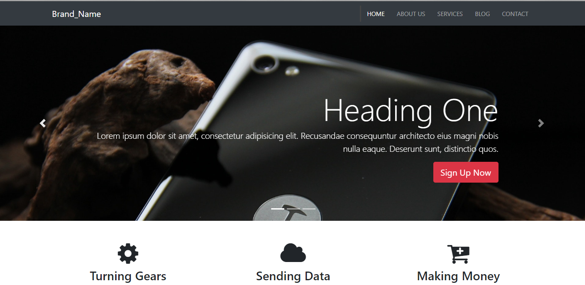
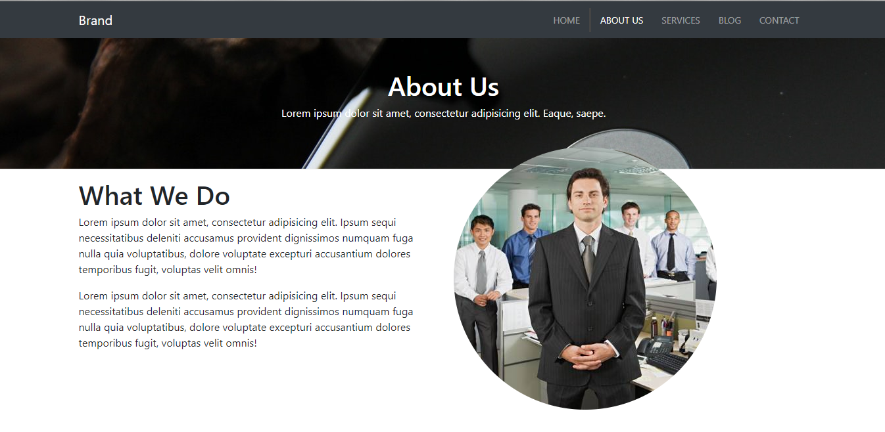
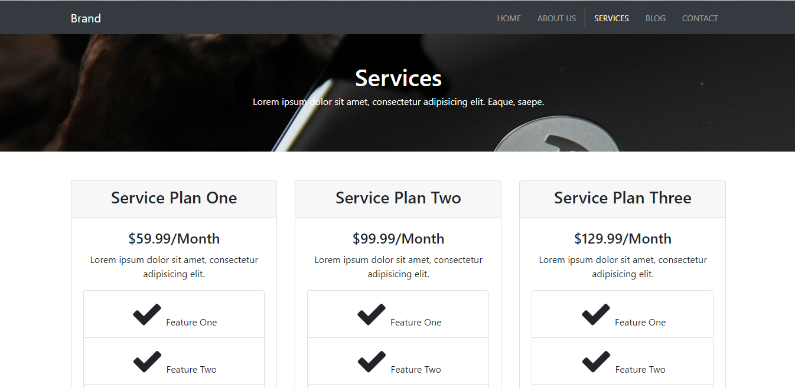
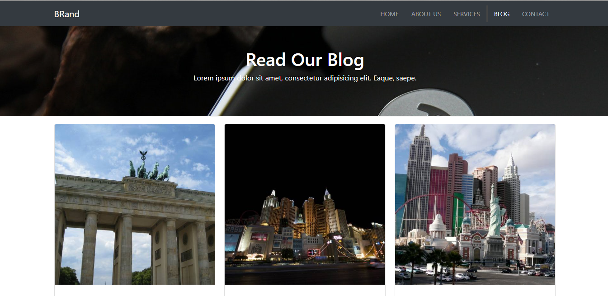
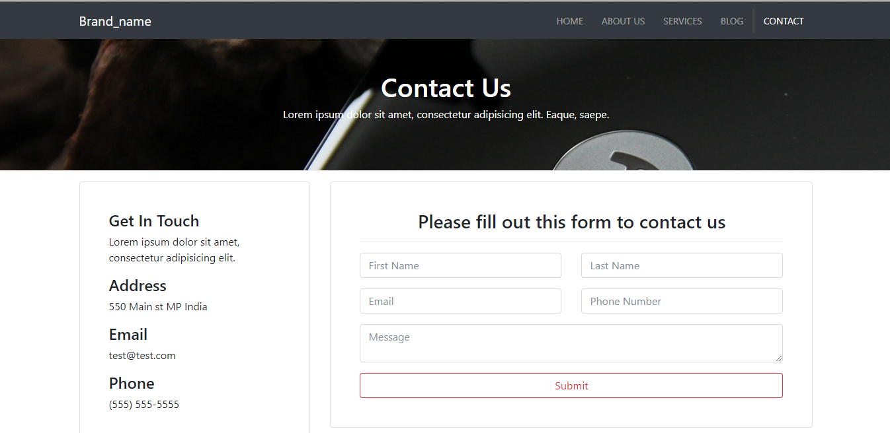

# Mutipage website UI
A decent multipage website UI made with Bootstrap, scss and css. It contains carousel, parallax, collapsible widgets, fixed scrolling, iframe, photogallery and much more. In photgallery, I have used a script called 'ekko lightbox'. Also, in testimonial slider, I have used slick slider.

#### Index Page 

#### About Page

#### Services Page

#### Blog Page

#### Contact Page

